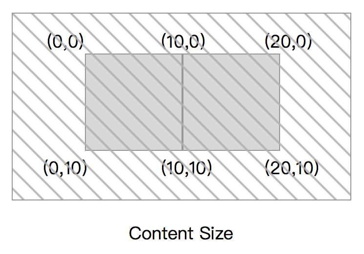

1. [ScrollView可见区域和内容区域](#header1)  
2. [ScrollView中添加子视图有以下两种方式](#header2)  
	* [为UIScrollView中的子视图和UIScrollView外的视图添加一个固定位置的约束](#header21)  
	* [人为地给UIScrollView添加一个“内容区域”的视图](#header22)  
3. [进阶：scrollView+autolayout+子视图自动撑高](#header3)

<!-- more -->	

<h3 id="header1">1. ScrollView可见区域和内容区域</h3>


UIScrollView有自己的**frame**也就是我们在屏幕上能看到的区域（***可见区域***）。它还有一个**contentSize**的概念（***内容区域***）

那么当我们在UIScrollView中的子视图中添加约束的时候，我们添加的约束是针对UIScrollView本身的可见区域呢，还是其内容区域呢？

以下是官方的解释（https://developer.apple.com/library/content/documentation/UserExperience/Conceptual/AutolayoutPG/WorkingwithScrollViews.html#//apple_ref/doc/uid/TP40010853-CH24-SW1）：

+ Any constraints between the scroll view and objects outside the scroll view attach to the scroll view’s frame, just as with any other view.

+ For constraints between the scroll view and its content, the behavior varies depending on the attributes being constrained:

	- Constraints between the edges or margins of the scroll view and its content attach to the scroll view’s content area.

	- Constraints between the height, width, or centers attach to the scroll view’s frame.

+ You can also use constraints between the scroll view’s content and objects outside the scroll view to provide a fixed position for the scroll view’s content, making that content appear to float over the scroll view.

大概意思是：

+ 对于UIScrollView和其它非子视图的约束，采用的方式和其它的视图类似，也就是采用其可见区域的left，right，top，bottom等；

+ 对于UIScrollView和它的子视图的约束而言，left，right，top，bottom采用的是UIScrollView的内容区域，而width和height则仍然是其可见区域的width和height。

你可以为UIScrollView中的子视图和UIScrollView外的视图添加一个固定位置的约束，这样可以达到让该子视图浮动在UIScrollView上面的效果。（想象一下UITableview的section header，当tableview 在滚动的时候，section header是固定在可见区域的顶部的）。

<h3 id="header2">2. ScrollView中添加子视图有以下两种方式：</h3>
<h4 id="header21">为UIScrollView中的子视图和UIScrollView外的视图添加一个固定位置的约束</h3>

``` OC
    UIScrollView *scrollView = [[UIScrollView alloc] init];
    scrollView.backgroundColor = [UIColor yellowColor];
    scrollView.delegate = self;
    [self.view addSubview:scrollView];
    [scrollView mas_makeConstraints:^(MASConstraintMaker *make) {
        make.edges.equalTo(self.view);
    }];
    
    UILabel *dataLabel = [[UILabel alloc] init];
    dataLabel.numberOfLines= 0;
    dataLabel.text = _longText;
    [scrollView addSubview:dataLabel];
    [dataLabel mas_makeConstraints:^(MASConstraintMaker *make) {
        make.left.equalTo(scrollView).offset(16);
        make.top.equalTo(scrollView).offset(16+64);
        make.right.lessThanOrEqualTo(self.view).offset(-16);
        make.right.equalTo(scrollView).offset(16);
        make.bottom.equalTo(scrollView).offset(-16);
    }];
```
需要注意的是，现在我们的界面是非常简单的，UIScrollView中只有一个UILabel，当UIScrollView中的子视图变得越来越多的时候，需要注意的地方就更多。假如有视图A,B,C,D...等是UIScrollView的直接子视图，当它们需要添加与UIScrollView的约束时，都要考虑到约束是和UIScrollView的内容区域关联而不是其可见区域。要考虑什么时候要借助UIScrollView外部的视图的属性建立约束。

<h4 id="header22">人为地给UIScrollView添加一个“内容区域”的视图</h4>

所有本来直接在UIScrollView下面的视图，都变成在额外添加的“内容区域”视图中，那么所有的约束都是和该视图关联，就不用再去考虑UIScrollView的特殊的地方了

``` C
    UIScrollView *scrollView = [[UIScrollView alloc] init];
    scrollView.backgroundColor = [UIColor yellowColor];
    scrollView.delegate = self;
    [self.view addSubview:scrollView];
    [scrollView mas_makeConstraints:^(MASConstraintMaker *make) {
        make.edges.equalTo(self.view);
    }];
    
    UIView *contentView = [[UIView alloc] init];
    
    [scrollView addSubview:contentView];
    [contentView mas_makeConstraints:^(MASConstraintMaker *make) {
        make.edges.equalTo(scrollView);
        make.width.equalTo(scrollView);
    }];
    contentView.backgroundColor = [UIColor lightGrayColor];
    
    UILabel *dataLabel = [[UILabel alloc] init];
    [contentView addSubview:dataLabel];
    [dataLabel mas_makeConstraints:^(MASConstraintMaker *make) {
        make.top.equalTo(contentView).offset(16);
        make.left.equalTo(contentView).offset(16);
        make.right.lessThanOrEqualTo(contentView).offset(-16);
        make.bottom.equalTo(contentView.mas_bottom).offset(-16);
    }];
    dataLabel.numberOfLines = 0;
    dataLabel.text = _longText;
```
这里的关键点在于contentView与scrollView的约束的建立。首先让contentView的边界和scrollView的内容区域的边界相等。

此时contentView的大小是不确定的，可以伸缩。那么根据我们的需求，我们只需要固定的宽度，然后让高度是可变的。那么我们添加宽度一个宽度的约束（根据官方文档，UIScrollView的width和height属性是其可见区域的属性）。这样contentView就只有高度是不确定的，那么我们通过dataLabel和scrollView的约束中计算出contentView的高度即可。

***总结***：设置UIScrollView自动布局约束的技巧

1. Add the scroll view to the scene.

2. Draw constraints to define the scroll view’s size and position, as normal.

3. Add a view to the scroll view. Set the view’s Xcode specific label to Content View.

4. Pin the content view’s top, bottom, leading, and trailing edges to the scroll view’s corresponding edges. The content view now defines the scroll view’s content area.

	**REMEMBER** The content view does not have a fixed size at this point. It can stretch and grow to fit any views and controls you place inside it.

5. (Optional) To disable horizontal scrolling, set the content view’s width equal to the scroll view’s width. The content view now fills the scroll view horizontally.

6. (Optional) To disable vertical scrolling, set the content view’s height equal to the scroll view’s height. The content view now fills the scroll view horizontally.

7. Lay out the scroll view’s content inside the content view. Use constraints to position the content inside the content view as normal.

	**IMPORTANT**: Your layout must fully define the size of the content view (except where defined in steps 5 and 6). To set the height based on the intrinsic size of your content, you must have an unbroken chain of constraints and views stretching from the content view’s top edge to its bottom edge. Similarly, to set the width, you must have an unbroken chain of constraints and views from the content view’s leading edge to its trailing edge.If your content does not have an intrinsic content size, you must add the appropriate size constraints, either to the content view or to the content.When the content view is taller than the scroll view, the scroll view enables vertical scrolling. When the content view is wider than the scroll view, the scroll view enables horizontal scrolling. Otherwise, scrolling is disabled by default.

***大意为：***

1. 添加一个scroll view

2. 像普通视图一样为scroll view添加位置和大小的约束

3. 在scroll view中添加一个子视图（content view），给该视图添加一个指定的标签（这个标签只是为了更好地显示）

4. 将content view的left，right，top，bottom和scroll view的边界建立相等约束。那么现在content view的边界就确定了scroll view的内容区域

	（**注意**此时content view还没有固定的大小，它可以根据你在其中设置的视图的伸缩大小）

5. （可选）如果不需要水平滑动，将content view的宽度设置为和scoll view的宽度相等。

6. （可选）如果不需要垂直滑动，将content view的高度设置为和scroll view的高度相等。

7. 在content view中添加子视图，为子视图和content view添加约束。


<h3 id="header3">3. 进阶：scrollView+autolayout+子视图自动撑高</h3>

上面介绍的常规用法中，ScrollView的可见区域大小是固定的，根据内容区域相对可见区域的大小，决定是否需要滚动及滚动方向；然而在实际使用中我们会遇到更复杂的情况，

例：scrollView中添加一个Label，可见区域有最大高度 ***MAX_HEIGHT*** ，要求当Label内容高度不超过 ***MAX_HEIGHT*** ，ScrollView可见区域高度等于label内容高度，不可滚动；当label高度超过 ***MAX_HEIGHT*** ，ScrollView可见区域高度固定为 ***MAX_HEIGHT*** ，label支持滚动。

             
``` C++
    UIScrollView *msgScrollView = [[UIScrollView alloc] init];
    [self addSubview:msgScrollView];
  
    UILabel *message = [UILabel new];
    [msgScrollView addSubview:message];
    
    [msgScrollView mas_makeConstraints:^(MASConstraintMaker *make) {
        make.top.equalTo(self).offset(10);
        make.left.equalTo(@20);
        make.right.equalTo(@-20);
        make.bottom.equalTo(@-72);
      // scrollView 设置最大高度限制
        make.height.mas_lessThanOrEqualTo(140).priorityHigh();
      // 当内容过少时，保障UIScrollView可以被Label撑开，low 是为了避免约束冲突
        make.height.equalTo(message).priorityLow();
    }];
​
    [message mas_makeConstraints:^(MASConstraintMaker *make) {
        make.left.top.right.bottom.equalTo(msgScrollView);
        make.width.equalTo(msgScrollView);
      // 保障可以正确的计算contentSize
        make.height.greaterThanOrEqualTo(msgScrollView);
    }];
```

**参考链接：**
https://blog.csdn.net/weixin_33708432/article/details/91474816

https://bestswifter.com/uiscrollviewwithautolayout/

https://www.jianshu.com/p/8818d0d8f2d5